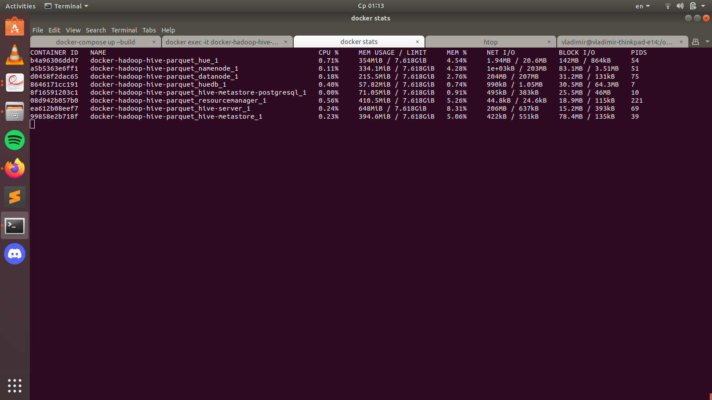
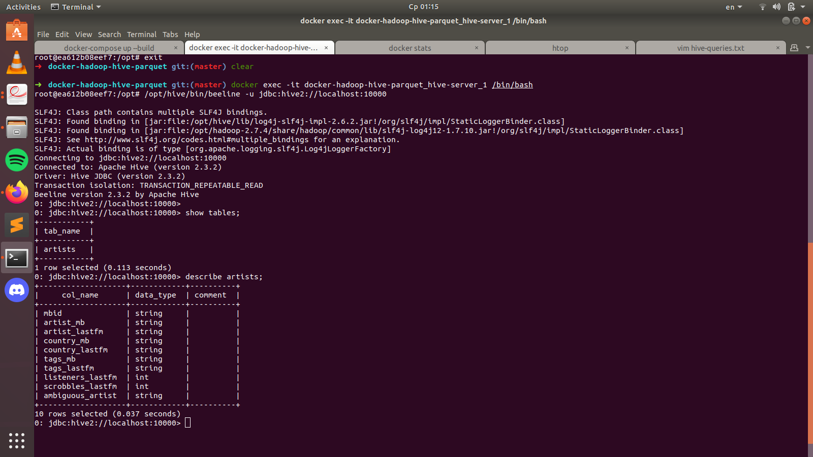
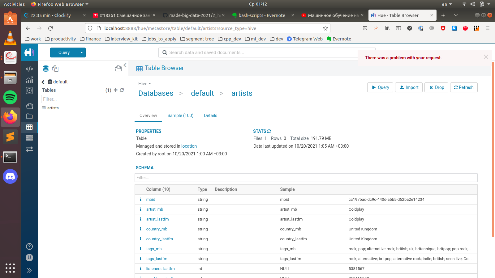

# Домашнее задание №2: Hive

### Блок 1. Развертывание локального Hive
  * поднимаем [докер-образ](https://github.com/tech4242/docker-hadoop-hive-parquet)
  * загружаем в hdfs [kaggle-датасет](https://www.kaggle.com/pieca111/music-artists-popularity)
  * загружаем датасет в hive-таблицу

### Блок 2. Запросы к загруженному датасету через HiveQL: [решение](https://github.com/GimmeDanger/made-big-data-2021/blob/master/hw/2_hive/hive-queries.txt)
  * Исполнителя с максимальным числом скробблов;
  * Самый популярный тэг на ластфм;
  * Самые популярные исполнители 10 самых популярных тегов ластфм;

#### Запускаем докер-образ, проверяем, что все контейнеры поднялись
<pre>
$ docker-compose up --build
$ docker stats
</pre>

> 

#### Копируем датасет на namenode, а оттуда -- в hdfs
<pre>
$ docker cp ~/Downloads/archive.zip docker-hadoop-hive-parquet_namenode_1:/
$ docker exec -it docker-hadoop-hive-parquet_namenode_1 /bin/bash 
$ unzip archive.zip
$ hdfs dfs -put artists.csv /
</pre>

#### Заходим на hive-server, затем в beeline
<pre>
$ docker exec -it docker-hadoop-hive-parquet_hive-server_1 /bin/bash
$ /opt/hive/bin/beeline -u jdbc:hive2://localhost:10000
</pre>

#### Создаем схему и заполняем значениями из датасета, который хранится в hdfs
<pre>
> CREATE TABLE artists (mbid string, artist_mb string, artist_lastfm string, country_mb string, country_lastfm string, tags_mb string, tags_lastfm string, listeners_lastfm int, scrobbles_lastfm int, ambiguous_artist string) ROW FORMAT DELIMITED FIELDS TERMINATED BY ',';
> LOAD DATA INPATH '/artists.csv' OVERWRITE INTO TABLE artists;
</pre>

> 

#### Проверяем также, что датасет доступен через hue по http://localhost:8888/:

> 
